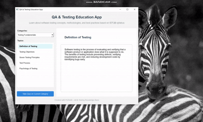

# 📚 QA & Testing Education App

Welcome to the **QA & Testing Education App**, a desktop application designed to teach **Software Testing Life Cycle (STLC)** processes, methodologies, and best practices.  
Built with **Python** and **Qt Framework (Qt6)**, this tool offers an interactive way to explore testing concepts and evaluate your knowledge through quizzes.

## 🎬 Demo



---

## ✨ Features

- 📘 **Learn STLC (Software Testing Life Cycle)** stages  
- 🧠 **Explore topics** such as test planning, test case design, defect management, and more  
- ✅ **Topic-based quizzes** to test your understanding  
- 📂 **Easy-to-use interface** with modern styling  
- ⚡ Lightweight and fully local (no internet required)

---

## 🧩 STLC Topics Covered

- Requirements Analysis  
- Test Planning  
- Test Case Design  
- Test Environment Setup  
- Test Execution  
- Defect Reporting & Management  
- Test Closure  
- Testing Methodologies (Black-box, White-box, etc.)  
- Agile Testing Principles  
- ISTQB Foundation Concepts

---

## 🖥️ Technologies Used

- 🐍 **Python 3.10+**  
- 🎨 **Qt6 / PySide6** (for GUI)  

---

## ⚙️ Installation & Setup

> Make sure you have **Python 3.10+** installed.

### 1️⃣ Clone the Repository
```bash
git clone https://github.com/your-username/qa-testing-education-app.git
cd qa-testing-education-app
```

### 2️⃣ Create a Virtual Environment (Optional but Recommended)
```
python -m venv venv
source venv/bin/activate  # Linux / macOS
venv\Scripts\activate     # Windows
```
### 3️⃣ Install Required Packages
```
pip install -r requirements.txt
```
requirements.txt includes:PySide6>=6.5

### ▶️ Run the Application
```python main.py ```

### 📂 Project Structure

    QTProject                       
    ├─ assets                    
    │  └─ icons.py               
    ├─ gui                       
    │  ├─ __pycache__            
    │  │  └─ qa.cpython-313.pyc  
    │  ├─ qa.py                  
    │  └─ quiz.py                
    ├─ logic                     
    │  ├─ knowled.ge_base.py     
    │  └─ quiz_manager.py        
    ├─ __pycache__               
    │  └─ quiz.cpython-313.pyc   
    ├─ main.py                   
    ├─ README.md                 
    └─ requirements.txt          
        


### 💡 Contribution
Feel free to fork this project and enhance it. Pull requests are welcome!
You can help by:
 - Adding new topics
 - Improving the quiz system
 - Enhancing UI/UX
 - Translating content


### 📬 Contact
For questions, suggestions or collaborations:
#### 📧 ozgebuyuktorun@outlook.com

### 📝 License
MIT License – you are free to use and modify this application.
